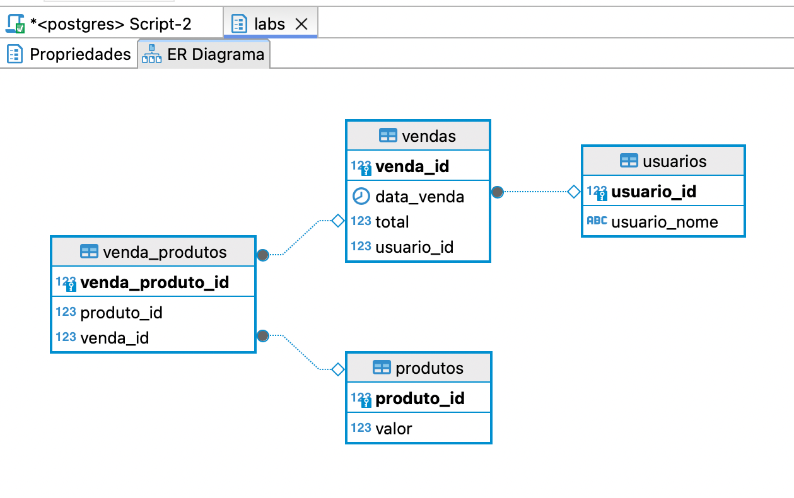
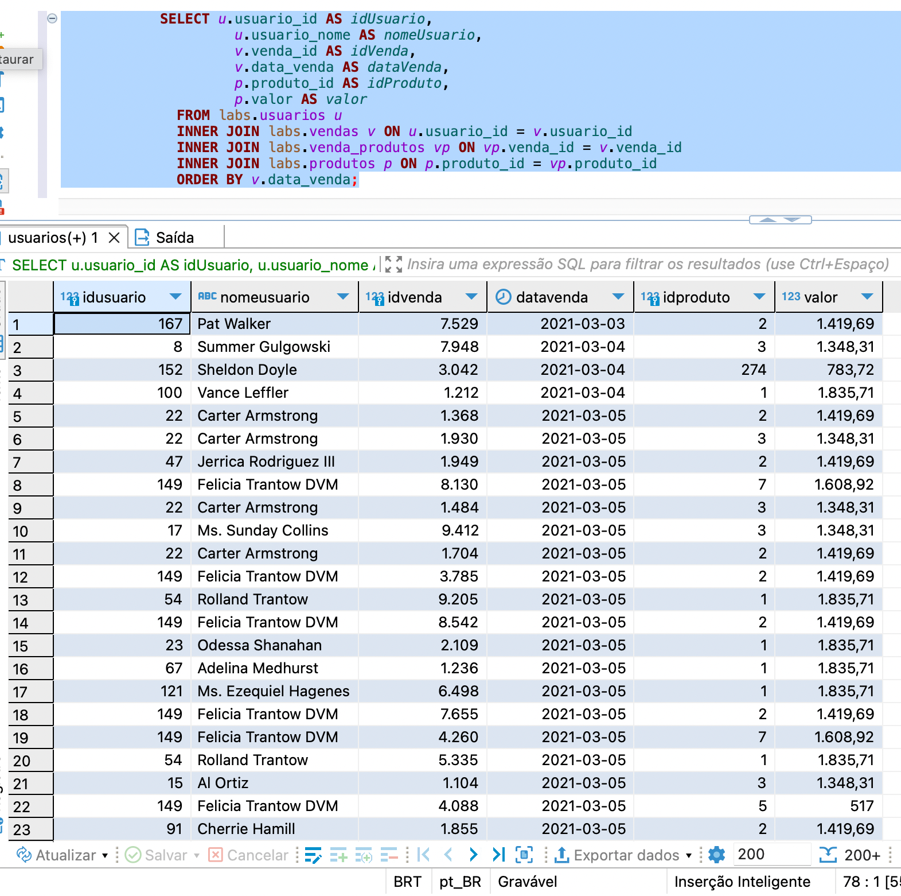

# Projeto Labs

Este projeto é um sistema para gerenciar vendas e produtos. Ele é desenvolvido usando Kotlin, Spring Boot, JPA e PostgreSQL.

## Estrutura do Projeto

- **Controller**: Responsável por receber as requisições HTTP e encaminhá-las para o serviço apropriado.
- **Service**: Contém a lógica de negócios da aplicação.
- **Repository**: Responsável pela comunicação com o banco de dados.
- **DTO (Data Transfer Objects)**: Utilizados para transferir dados entre as camadas da aplicação.

## Configuração do Projeto

### Requisitos

- JDK 17
- Maven
- PostgreSQL

### Configuração do Banco de Dados

Certifique-se de ter um banco de dados PostgreSQL rodando e configure as credenciais no arquivo `application.properties`.

```properties
spring.application.name=labs
spring.jpa.properties.hibernate.jdbc.lob.non_contextual_creation=true
spring.datasource.url= jdbc:postgresql://localhost:5432/postgres?currentSchema=labs
spring.datasource.username=seu_usuario
spring.datasource.password=sua_senha
spring.jpa.hibernate.ddl-auto=none
spring.jpa.properties.hibernate.dialect=org.hibernate.dialect.PostgreSQLDialect
```
## GIT
Clone o repositório:
```properties
git clone https://github.com/isabelamedeiros/labs.git
cd labs
```
#### Comandos de Build
- **Compilar o projeto**: `mvn clean compile`
- **Construir o projeto**: `mvn clean install`
- **Execute a aplicação**: `mvn spring-boot:run`

### Testes
Foi realizado alguns testes unitários usando JUnit e Mockito para garantir que o código funcione conforme esperado.

#### Comandos de Testes
- **Executar testes**: `mvn test`

## Endpoints Disponíveis
### Listar Dados
#### GET /labs/obter-dados
* Descrição: Retorna todos os dados de venda de produtos.

### Listar Vendas por ID
#### GET /labs/{idVendaProduto}/listar-vendas
* Descrição: Retorna as vendas pelo ID da Venda do Produto.
* Parâmetros:
  * idVendaProduto (Path): ID da venda do produto.

### Listar Vendas por Data
#### GET /labs/listar-por-data?dataInicio={dataInicio}&dataFim={dataFim}
* Descrição: Retorna as vendas dentro do intervalo de datas especificado.
* Parâmetros:
  * dataInicio (Query): Data de início do intervalo.
  * dataFim (Query): Data de fim do intervalo.

### Listar Pedidos
#### GET /labs/listar-produtos
* Descrição: Retorna uma lista de pedidos com detalhes de vendas e produtos agrupados por usuário.

### Salvar dados
#### POST /labs/salvar-dados
* Descrição: Carrega um arquivo de texto, formata os dados e persiste no banco de dados.

## Modelagem do banco de dados seguindo as regras de normalização.
- Não existe mais de uma informação em uma célula.
- Os dados de cada tabela dependem da chave primaria.
- Os atributos das tabelas não dependem de atributos que não sejam a chave primaria.
- As tabelas estão relacionadas pelas chaves estrangeiras, criando o relacionamento das informações.
- A tabela venda_produtos recebe a chave estrangeira de produto_id e venda_id.
- A tabela vendas recebe a chave estrangeira usuario_id.
- Cada tabela possui um ID.
- A tabela venda_produtos para vendas e para produtos representa uma relação de muitos-para-muitos.
- A tabela usuarios para vendas, vendas para venda_produtos e produtos para venda_produtos representa uma relação de um-para-muitos.

### Diagrama entidade relacionamento

### Dados persistidos

## SOLID
* Princípio da Responsabilidade Única
  * Cada classe ou módulo deve ter apenas uma responsabilidade. A classe VendaProdutoService está focada em fornecer serviços relacionados a vendas de produtos.
* Princípio da inversão de dependência
  * As classes de alto nível não devem depender de classes de baixo nível, ambas devem depender de abstrações. A classe VendaProdutoService recebe dependências de VendaProdutoRepository e VendaRepository usando construtores.
* Princípio do aberto/fechado
  * As classes devem ser abertas para extensão, mas fechadas para modificação. O projeto Labs até o momento não fez estendeu a classe VendaProdutoService, não sendo possivel demonstrar a cobertura desse principio.
* Princípio da substituição de Liskov
  * As classes derivadas devem poder ser substituidas de suas classes base sem alterar seu comportamento. O projeto Labs até o momento não utilizou herança, não sendo possivel demonstrar a cobertura desse principio.
* Princípio da segregação de interface
  * As interfaces específicas são melhores do que uma unica interface de propósito geral. O projeto Labs até o momento utilizou apenas uma interface para atender a necessidade de um retorno especifico.

## Contato
Isabela Medeiros - mmedeirosisabela@gmail.com